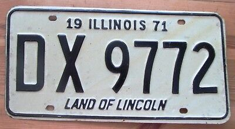
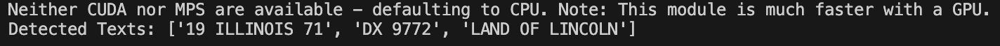

# Number Plate Recognition

This project demonstrates a basic implementation of number plate recognition using Python, OpenCV, and EasyOCR. The program preprocesses an input image, detects the number plate region, and uses EasyOCR to extract and display the text from the number plate.

## Features
- Preprocess images to enhance text visibility.
- Detect potential number plate regions using contour detection.
- Extract and read text from detected regions using EasyOCR.
- Displays results with bounding boxes and extracted text overlayed on the image.

## Requirements
Ensure the following dependencies are installed:

- Python 3.6+
- OpenCV
- EasyOCR
- NumPy

Install the dependencies with pip:
```bash
pip install opencv-python-headless easyocr numpy
```

## Usage
### Input
Place the input image (`pl1.jpeg`) in the project directory. The script will process this image to detect the number plate and extract the text.

### Running the Script
Run the script with the following command:
```bash
python numberplate_recognition.py
```

### Output
The script will:
- Display the processed image (`pl1.jpeg`) with detected text overlayed.
- Save the output with bounding boxes as `res.png` in the results directory (if implemented).
- Print the detected text in the console.

### Example
#### Input Image:
`pl1.jpeg`

#### Output:
`res.png`

#### Console Output:
```
Detected Texts: ["XYZ 1234"]
```

## Results
### Input Image


### Output Image



## License
This project is licensed under the MIT License.

